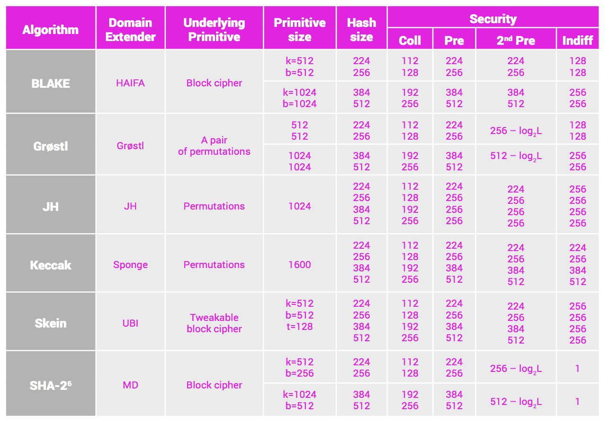
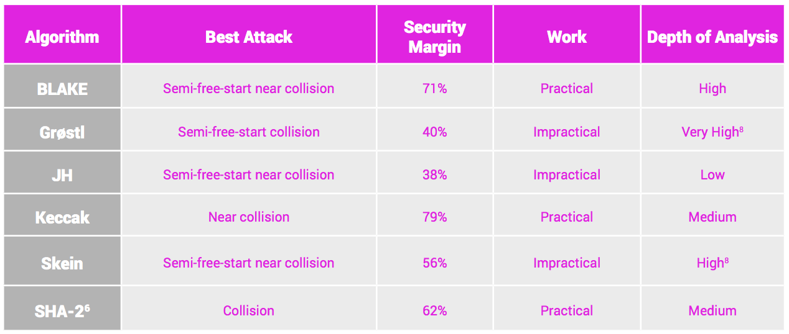
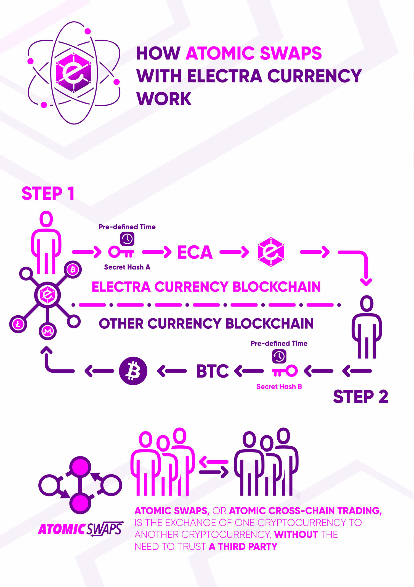
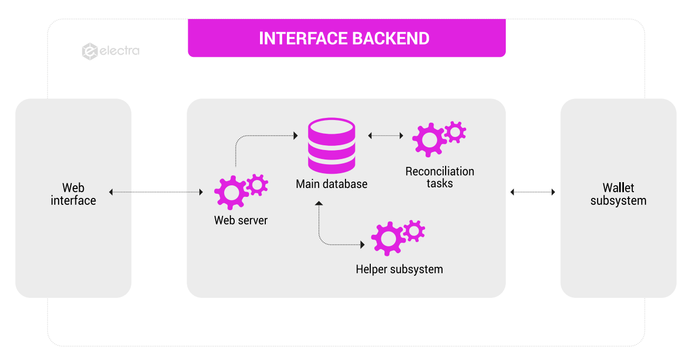

# Electra White Paper - The Open Paper

17 May 2018

### Abstract

Electra is an open source community-driven cryptocurrency project featuring decentralized and distributed governance. Electra’s foundation is a blockchain based on the NIST5 algorithm, guaranteeing fast and secure transactions with nearly non-existent transaction costs.

Electra’s goal is to become the electric current of the cryptocurrency community. Our vision is to advance the evolution of our economic system as originally proposed by Satoshi Nakamoto.

Electra is a unique cryptocurrency in that it is both a development project and a contract. Despite being a fully operational cryptocurrency at present, Electra is an ongoing development project subject to review, innovation, and updating.

Electra is also a contract that offers the investor full participation in the development process, including but not limited to the following: 

* Access to Electra community

* The right to obtain project information

* Involvement in development decisions

* Comprehensive voting rights

* Access to technical support

The Electra Blockchain and the ECA coin are a product of the combined skills and abilities of an ever-growing community of coders, developers, business professionals, and other contributors. ECA is built on a fully functional and feature rich blockchain with a stable and solid foundation. This foundation provides the reliable platform needed for our talented community of developers to innovate, invent, and build upon. Blockchain technology evolves on a daily basis. As this technology improves, ECA’s foundation will expand and grow in tandem with the latest innovations.

Digital currency was created to bring change to the financial world through the decentralization and disintermediation of the global financial ecosystem.
Progress towards this goal has thus far been inhibited by insufficient technical tools that alone are simply not enough to affect mass adoption of blockchain technology. Recent technological developments are only now beginning to unlock new possibilities, resulting in paradigm shifts within the cryptocurrency ecosystem regarding the scalability, accessibility, speed, and cost of blockchain applications.

The opportunity for dramatic change within a developing ecosystem is unfortunately time limited. Newly developed systems evolve quickly, rapidly reaching a point where progressive and lasting change is inhibited by the structures built during each stage of evolution. As blockchain technology moves towards structural boundaries within the ecosystem there is a period of time in which greater freedom of action for the evolutionary forces at work is possible. For cryptocurrencies and blockchain technology as a whole, that time is now. 

Electra is positioned to become one of the main driving forces of change while these windows of opportunity remain open.

Participants within the traditional economic structure are attempting to employ old logic to adapt to the ongoing restructuring of our economic system, subverting the original intent behind the cryptocurrency movement. The cryptocurrency community must recapture the original spirit behind decentralization
and the Electra Project is prepared to lead the way. ECA owners are no longer just investors in a cryptocurrency. Instead, by being directly involved in the decision-making process investors take part in the entire underlying structure: code innovation, design, marketing, community building, and strategic business development. 

Through this process, participants within the economic system are no longer relegated to being mere consumers. Electra returns the power to the people and assigns members of the community an active role in the evolution of our economic and monetary systems.

# Table of Contents

- [Abstract](#abstract)
- [Electrifying the Cryptocurrency Community](#electrifying-the-cryptocurrency-community)
   - [Investor Benefit](#investor-benefit)
   - [Innovative and Open Development Process](#innovative-and-open-development-process)
   - [Electra Sets New Standards for Cryptocurrencies](#electra-sets-new-standards-for-cryptocurrencies)
- [Current Technology](#current-technology)
	- [The Algorithm](#the-algorithm)
	- [The Electra Blockchain](#the-electra-blockchain) 
	- [Purpose and Use of Pre-mined ECA](#purpose-and-use-of-pre-mined-eca)
	- [Fast Payments](#fast-payments) 
	- [Transaction Fees Approaching Zero](#transaction-fees-approaching-zero)
	- [Staking Rewards](#staking-rewards)
	- [Optional Privacy](#optional-privacy)  
	- [Environmentally Friendly](#environmentally-friendly)
- [Future Technology](#future-technology)
- [Electra Ecosystem](#electra-ecosystem)
	- [The Electra Family of Products](#the-electra-family-of-products)  
	- [Electra Services](#electra-services)
      - [Integrated Merchant and User Support](#integrated-merchant-and-user-support)
	- [ElectraPay](#electrapay)  
	   - [SocialPay](#socialpay)
       - [Who Is SocialPay For?](#who-is-socialpay-for)
    - [Atomic Swaps](#atomic-swaps)
       - [Applying Atomic Swaps](#applying-atomic-swaps)
    - [Master Nodes](#master-nodes)
- [Web Wallet](#web-wallet)
- [Roadmap](#roadmap)
    - [Milestones Achieved](#milestones-achieved)
    - [Planned Goals and Objectives](#planned-goals-and-objectives)
- [Electra Team](#electra-team)
- [Founder's Vision](#founders-vision)
- [Updates and Upgrades to this White Paper](#updates-and-upgrades-to-this-white-paper)
- [The Open Paper](#the-open-paper)
- [Disclaimer](#disclaimer)

# Electrifying the Cryptocurrency Community

Electra is more than a common digital currency. It is a currency backed by an entire community of dedicated individuals. Electra’s goal is to create the strongest possible community of individuals who all share the same philosophy of change with regards to global monetary systems. Through transparency and empowerment, we are shining a new light on a darkening system. This is not a
zero sum game; this is Electra.

Our vision for Electra is that it becomes the largest and most active cryptocurrency community within the market space. An active global community provides investors an opportunity to assume roles as active players and contributors.
Electra is not only a decentralized organization, but a unique and powerful revolution based on shared ownership and collaboration among the skilled experts throughout our community.

## Investor Benefit

ECA investors hold a stake in the Electra organization and are encouraged to become directly involved in the development process. All investors are owners of both the cryptocurrency and the entire infrastructure that exists behind the project.

## Innovative and Open Development Process

The underlying architecture of the Electra Project is continuously subjected to multiple stages of validation. Through the validation process only the most valuable changes are adopted and integrated. Any and all decisions are subjected to review by the community prior to implementation. Even an optimal system has limits. Guarantees of reversibility and the highest level of quality are needed. One of Electra’s strengths is the ability to adapt and consistently meet the needs of a changing global environment.

Building and deconstructing simultaneously is necessary to create the best possible product given the current limitations, and at the same time provide for the ability to further refine the product. In doing so we must accept the possibility that the existing technology has room to improve or that the underlying factors of previous developments have changed. Our methodology allows for continuous evolution of the technology within a changing environment. The resulting development will produce the best possible product at any given time.

## Electra Sets New Standards for Cryptocurrencies

The best product is the one capable of becoming completely different from its origins. Today, the leading cryptocurrencies on the market can only guarantee their relevance to investors for an ephemeral period. What is now at the forefront of the market will soon be outdated and outclassed by innovative competitors.

As a community we synthesize and condense the vision of many individuals, compare and contrast diverse viewpoints, and examine possible outcomes. The results of this process are subjected to review and analysis by a multitude of viewpoints, allowing for the systematic detection of probable errors.

This approach ensures that only the most valid ideas survive to reach implementation. To reach our goals it is necessary to widen the scope of discussion as much as possible and to extend an open dialogue indefinitely.

The end result of our efforts is the Electra Project.

The Electra Project’s primary points of focus are the following:

* Design and build the most cutting-edge cryptocurrency

* Create a financial ecosystem for the community

* Ensure that the project is driven by community needs

* Evolve the product over time, utilizing best practices

# Current Technology

## The Algorithm

ECA is built using an algorithm that guarantees security; NIST5. NIST5 is an algorithm developed using the best features of the five SHA-3 finalist algorithms as selected by the National Institute of Standards and Technology of America.
In practice, the NIST5 algorithm as implemented in ECA selects the most beneficial attributes of each component algorithm to maximize performance, security, and efficiency. These component algorithms include:

* BLAKE

* Grostl

* JH

* Keccak

* Skein

** NIST Competition Summary   [http://nvlpubs.nist.gov/nistpubs/ir/2012/NIST.IR.7896.pdf](http://nvlpubs.nist.gov/nistpubs/ir/2012/NIST.IR.7896.pdf)    

** Handbook of Digital Currency Bitcoin Innovation, Financial Instruments and Big Data.pdf

## The Electra Blockchain

The underlying blockchain of the ECA coin utilizes a modified version of the NIST5 algorithm with the following properties: 

* Block Size: 1MB

* Block Time: 5 minutes (288 blocks per day) >>> after blockchain fork >>> 90 seconds (960 blocks per day)

* Max Supply: 30,000,000,000

* Pre-mined: 1,000,000,019 (approximately 3.34%)

* Difficulty Target: Retarget occurs every 15 minutes (every 3 blocks)

* Fee: 0.00001 ECA

## Purpose and Use of Pre-mined ECA

1,000,000,019 (Approximately 3.34%) ECA were pre-mined using Proof of Work (PoW) mining. Pre-mined funds are maintained by a trusted Community Funds Manager. Distribution and use of funds is determined by consensus. Pre-mined funds will be used for various purposes including but not limited to the following:

* Maintaining the security and usability of the platform

* Funding further development projects as outlined by Electra Roadmap

* Application to new exchanges

## Fast Payments

ECA transactions are received in the recipient’s wallet almost instantly and the ECA received is spendable as soon as the transaction is confirmed in the blockchain. The confirmation process requires less than five minutes. After the upcoming hard fork, confirmations will require 90 seconds or less.

## Transaction Fees Approaching Zero

With transaction fees on the Electra network of 0.00001 ECA, it takes 100,000 transactions to accumulate one ECA worth of transaction fees (approximately $0.004 USD at time of this publication). The resulting cost per transaction is approximately $0.00000004.

## Staking Rewards

Currently, ECA features a 50% annual stake reward rate as an introductory rate. In order to increase the stability and longevity of the Electra Project, the annual stake reward rate will be reduced to 10% in Q3 of 2018. After the staking reward reduces to 10%, it will halve to 5% the following year, and 2.5% every year thereafter. There is no fixed reward per block. Each stake reward is proportional to the amount staked relative to the total ECA in circulation. 

Minimum stake age: 24 hours

Maximum stake age: 30 days

Additional information regarding the Proof of Stake reward structure for ECA can be found at: 

* https://electraproject.org/crypto-wallet-staking-guide-electra-project

## Optional Privacy

Future developments within the Electra ecosystem will allow for the use of privacy gateways, including but not limited to the following:

* TOR

* IP2 networks 

* Kovri

Users will be able to select the privacy functions best suited to their individual needs. The Electra community is continually working to identify the most scalable and efficient gateway configurations to ensure privacy of transactions.

## Environmentally Friendly

The NIST5 algorithm utilized by the ECA cryptocurrency is more environmentally friendly than competing technologies and has proven to be a sustainable option for deployment of blockchain-based systems. NIST5 requires significantly less energy to run than competing algorithms without compromising the security of network members. 

Furthermore, Electra does not have an extended Proof of Work (PoW) phase. Electra’s blockchain network is now Proof of Stake (PoS) which results in no miners and a greatly reduced carbon footprint.

# Future Technology

When you invest in ECA you become a stakeholder in a fully open source project aimed at developing the most cutting-edge technology for the evolution of cryptocurrency. Investors who choose Electra will be a part of this journey. Current technology is a good starting point however, creating the cryptocurrency of the future requires going beyond the limits of existing technology. 

The strength of Electra resides in the contract that guarantees investors full participation in the direction of the project, including all future developments and technologies. ECA’s potential growth is guaranteed because tomorrow’s ECA will not be just another coin, but rather an adaptation to future societal and economic needs. Investors can be confident that when they purchase ECA, they are investing in the present and future growth of a unique cryptocurrency ecosystem.

If an algorithm emerges that is more efficient and superior to NIST5, Electra’s development team is prepared to adapt ECA’s underlying structure to maintain a competitive advantage in the market. As Electra grows the block time can be reduced and the block size can be increased. The adaptability of ECA allows for the blockchain to be maintained while the algorithm is rewritten from scratch.
In effect, Electra is a blank paper for writing revolutionary code. Writing the code of the future on an already active codebase results in a deployed structure that neither obstructs, limits, nor hinders future development. ECA’s architecture allows a subsequent structure to intersect, connect, flank, or replace the existing structure. Electra provides a better solution than existing currencies can and guarantees the community full control.

# Electra Ecosystem

In order for merchants to complete transactions, they need to be able to accept payments from consumers. In today’s world merchants do not have the proper technical tools at their disposal for accepting digital currency as a form of payment. Merchants that do accept digital currencies are paying extremely high fees to do so.

Despite the proliferation of technology across the globe, many developing regions of the world continue to operate within a system where the ‘Cash is King’ philosophy remains dominant in conducting commerce. Ease of adoption provided by the Electra ecosystem combined with easy access to mobile Internet in developing countries provides a secure, fast, and low fee payment gateway for both consumers and merchants alike, regardless of where they live.

## The Electra Family of Products

Electra’s family of products can be summarized into the following categories. Each product will be described in greater detail below.

* Desktop Wallets  (Windows, Linux, Mac)

* Mobile Wallets (iOS & Android) 

* Web Wallet

* Merchant Applications

    * Plugins for eCommerce Applications

    * Merchant Mobile Applications

    * Merchant Desktop Software

    * Centralized Online Payment Gateway

Each product will be available to any person who has a need to make quick and secure transactions with low fees. The development of wallets, applications, and software are driven by the community. Each product will include an integrated support framework, containing user guides and live support from the community.

## Electra Services

The following services will be provided across all products offered by Electra: 

* Integrated Merchant & User Support

* ElectraPay

* SocialPay

* Atomic Swaps

* Master Nodes

* Web Wallet

### Integrated Merchant and User Support

At Electra we understand that the idea of managing a digital wallet and using digital currencies may be a little daunting for some. We are integrating a community support system into the Electra family of products. Regardless of where you are located around the world, there will be someone from the 10,000 plus member community that will be able to provide you with support and assistance using the Electra Payments Gateway and other Electra products and services.

## ElectraPay

ElectraPay is a community-driven payment solution for merchants. The codebase consists of a centralized payment facility connected to plugins available for most e-commerce platforms including Magento, WooCommerce, and Shopify.

The ElectraPay system allows merchants to receive payments for their goods and services by easily installing the plugin to their e-commerce websites. Customers will then be able to select ECA as a payment method. The plugin will convert the fiat value to ECA using the latest official ECA price as drawn from multiple exchanges. The customer is then shown a payment address along with a QR code.  

When the ElectraPay system detects initiation of a payment, it sends a validation call to the merchant’s website and routes the ECA through the ElectraPay system to obfuscate the final payment address. Merchants using this plugin can be confident that their transactions and wallets are secure and concealed from the customer.  

Merchants will easily be able to install the ElectraPay plugin to their online stores and the plugin is fully customizable to suit the merchant’s needs. Merchants wanting to use custom code in their own payment page will be able to do so with the open ElectraPay API. 

Below is a chart showing the various building blocks of the ElectraPay system.

## SocialPay

SocialPay by Electra is an automated application that enables individuals and organizations to leverage the power of Social Media. This is accomplished by initiating ECA transactions on a large scale, allowing content providers and organizations to send or receive ECA within their existing Social Media audiences. 

Electra’s Social Pay application is currently integrated with the platforms of Twitter, Telegram, Discord, and Slack. As development of this service continues additional Social Media platforms will be added to include Facebook, Reddit, Instagram, Weibo, and others.

### Who Is SocialPay For?

The current version of SocialPay is designed for communities who would like to send or receive ECA using their favorite Social Media platform. SocialPay allows users to send and receive ECA by simply posting a message to their Social Media account. This message can be either public or private.

Possible scenarios where SocialPay could be used include but are not limited to the following.

* Content creators and non-profit organizations accepting donations

* Rewards-based community building

* Crowdfunding

* Participation in ICO or Token Sales

Provided below is an example of how SocialPay may be used.

* The Red Cross is responding to an emergency situation and would like to raise funds to provide relief for those affected. By using the Electra SocialPay application and asking their followers for donations via Twitter, they can reach their entire audience within minutes. Once the application is set up, any Twitter user will be able to send an ECA donation via a direct message to the Red Cross. The Red Cross will then instantly receive the ECA within its account and be able to use the funds where they are most needed.

Future developments within Electra’s SocialPay application are aimed at expanding the possible field of Social Media participants.

## Atomic Swaps

Why Atomic Swaps?

Thousands of cryptocurrencies are currently in existence and the number continues to grow exponentially as blockchain technology is adopted. It remains a complex task to exchange one cryptocurrency for another when payment needs require different currencies. Cryptocurrency transactions are currently not reversible. This requires the use of a trusted third party to ensure that both sides of a transaction are resolved, so exchanges are used to accomplish the trading of different cryptocurrencies. The Electra community understands the need to fill this void. Atomic Swaps is the answer.

Electra’s atomic swap architecture generates a hash-time-locked contract, which uses multi-signature addresses and time locks to secure the transaction at an agreed upon price.

In a two-party cryptocurrency transaction using atomic swaps on transactions on differing blockchains can occur simultaneously and can be secured by the sharing of a private code between both parties. Use of the private code by one party will only complete the transaction if the second party also uses the same private code. Failure by one party to send the agreed upon amount of currency or to enter the correct code results in cancellation of the transaction and the return of all funds to their original location. This process removes the need for trusted third-party intervention.

Imagine you want to use ECA to pay for pizza at a restaurant that accepts only Bitcoin. A complex series of operations must first take place as illustrated below:

* Access an exchange

* Send ECA to that exchange

* Sell ECA for Bitcoin

* Open a Bitcoin wallet application

* Transfer Bitcoin to that wallet from the exchange

* Wait for the Bitcoin transaction to confirm

* Pay for your (cold) pizza

It is easy to see why the process is not currently used in commercial interactions at the retail level.

### Applying Atomic Swaps

The following is a list of operations that would be required with Atomic Swap technology employed in the same transaction: paying for pizza with ECA at an establishment that only accepts Bitcoin.

* Open your Electra application

* Scan the Bitcoin QRCode

* Confirm the payment within the application

Atomic Swap technology greatly reduces the complexity of the transaction between customer and merchant by removing the necessity of knowing which cryptocurrency is accepted at a given location. Both the non-ECA blockchain and the ECA blockchain confirm the transaction. If either blockchain rejects the transaction ECA is returned to the customer’s wallet.

## Master Nodes

Master Node implementation is an essential part of the ECA development process. Implementing Master Nodes on the ECA network will provide the following main benefits:

*  Faster Transactions on the ECA Network

*  Increased Privacy of Transactions

*  Improved Health and Stability of the ECA Network

*  Improved Decentralization of the ECA Ecosystem

To initiate and run a Master Node, Electra community members apply to the core development team to obtain Node specifications and requirements. Development of Master Nodes on the ECA network is ongoing. Refer to the most recent version of the roadmap for target release dates.

## Web Wallet

Not all users want to install a desktop or mobile wallet. Electra’s Web Wallet offers an online solution that provides users the same functions. The following main development blocks have been identified:

* Wallet Subsystem

* ECA Core

* Web Frontend

* Mobile Extension Interface (Optional)

The Mobile Extension Interface (MEI) allows the end user to access their web wallet from a personal device. The MEI integrates with other 3rd party applications (Whatsapp, Telegram, address book) allowing the user to employ the Electra SocialPay service to send ECA via Social Media.

**Wallet Subsystem**

The wallet subsystem implements all standard wallet features:

* Wallet Core

    * Send, Receive and Stake ECA

* Wallet Database

    * Backup Daemon

    * Full or Incremental backups

    * User Defined Backup Policies

    * Disaster Recovery Process

**ECA Core**

The ECA Core is the backend engine consisting of the following modules:

* Web Server

* Reconciliation tasks

    * Guarantees data integrity

    * Synchronization between the wallet subsystem and the database

* Helper Subsystem

    * Tasks to ensure system healthiness

    * Administrative tasks - backups

    * End-user messaging

* Database

    * Contains user information

    * User contacts

    * Dashboard settings

    * Configuration settings

    * Security settings

    * Profile settings

    * Wallet information including balances and staking

**Web Interface**

The Web Interface is the front-end interface between the user and ECA Core and includes the following modules:

* Client GUI Server Interface

    * Web user interface

    * Compatible with the given baseline of browsers/versions

    * Ability to run on mobile and PDA devices

* Server Interface and requests serialization

    * Uses secure WebSockets to open communication between Electra Core and the front-end system

    * The server interface implements a transactional subsystem

    * The transactional subsystem implements serialization of concurrent user's requests and vice versa

    * Transactions can be synchronous or asynchronous

* Security and authentication

    * Enforces standard login policies 

        * Login Form

        * 2FA

    * Web protection features

        * recaptcha 

        * DDoS

    * Private API

        * Implementation of the wallet API by the mobile wallet application (also known as Mobile Extension Interface)

# Roadmap

Below you will find a truncated version of our roadmap for reference current as of the time of this publication. For the most current version and additional detail regarding the Roadmap please visit https://electraproject.org/road-map

## Milestones Achieved

**Q3 2017:**

* Block Explorer completed

* Development of pool for PoW

* Early miners supported with strategic buy offers

* Listing on at least one (1) exchange

* Listed on https://coinmarketcap.com

**Q4 2017:**

* Increase the number of nodes on the network

* Listed on at least 3 (three) exchanges

* Development of online communities and social media pages dedicated to Electra

* Complete the roadmap, new website, and new block explorer

* Reach 2,000 users on Telegram

* Create educational material for Electra

**Q1 2018:**

* Impact marketing campaign launched to increase awareness of Electra

* Reach 10,000 users between Discord and Telegram

* Establish Team Account for Electra Project developers on GitHub

* White Paper Release

* Enable Testnet on blockchain

* Commence ElectraPay project development

* Release Linux Wallet

* Commence Mobile Wallet development

* Release customized Desktop Wallets

* Implement new GUI interface design with special features for desktop wallets

* White Paper Update 1.02

* (Optional) Coinomi integration for Electra mobile environment wallet option

* Boost adoption Phase 1: 

    * Commence Atomic SWAP development

    * Listings on new exchanges

    * Target new merchants: Several new merchant contacts will be started in order to expand the usage of Electra during daily operations
    
    ## Planned Goals and Objectives

**Q2 2018**

* Release of Mobile Wallets: Proprietary IOS and Android wallet development

* Payment Gateway Integration

* Release of SocialPay Application

* Commence online merchant payment API/Gateway development

* Tor Integrated Wallets: Use TOR/I2P networks to boost privacy features (optional)

* Boost adoption Phase 2: 

    * Listings on more new exchanges

    * Further additions to merchant base

* Release Atomic Swap.

**Q3 2018:**

* Commence Masternodes Development

* Release Web Wallet

* Payment gateway integration phase 2: Continue with the online merchant payment API/Gateway development

* Boost adoption: Phase 3

    * Listings on more new exchanges

    * Further additions to merchant base

* Deploy Master Nodes on the ECA Network

**Q4 2018**

* Release New Roadmap

# Electra Team

The Electra Community is rapidly expanding and organizing in new ways. All active members of the Management & Development Team and their qualifications will be continually added to the official Electra Project website.

[https://electraproject.org/our-team](https://electraproject.org/our-team).   

Join Electra’s Discord server and meet our community of developers, contributors, moderators, Electrans, and community members. Decisions regarding team membership are made by community consensus. 

* [https://discordapp.com/invite/B8F7Jdv](https://discordapp.com/invite/B8F7Jdv)

Our list of team members is subject to change based on the needs and desires of the community.

# Electra Project Team

The Electra Community is a large and diverse group of talented individuals. We have recently restructured our team in order to better organize and complete future goals of the Electra Project. We are a collection of dedicated members with brilliant minds, extensive experience, and a passion for blockchain technology, working towards the advancement of the cryptocurrency industry. Below is the new organization of our backend-development team, responsible for the progression of the Electra Project. 

## Founder

E01#3675 - Electra Founder & Developer

## Global Coordination

Ivan#9565- Global Coordinator / Lead Developer

Renat_77#0464- Global Coordinator

ECA Mom#7044- Global Coordinator

Asmoth#0436 - Global Coordinator / Community Governance Coordinator

Master Den#8523 - Global Coordinator / Financial Pole Coordinator

## Community Governance Team

Asmoth#0436 - Community Governance Coordinator & Democracy Moderator

Ryu#9160 - Democracy Head Planner

Ms. ECA Giraffe#5553 - Community Governance Coordinator & Democracy Planner

CryptoLife#2846 - Democracy Planner

Zarag (Quokka)#2781 - Democracy Planner

## Communications Team

pbp8ntballer#1492 - Communications Coordinator

## Design & Content Team

ECA Walrus#3342 - 2D Designer

Prophet Cable#8792 - 3D Animator

ECA Link#2068 - Design & Content Coordinator Illustrator/Designer

Frank Castle#0420 - Artistic Designer

freematikk#9191 - Graphic Designer

CoinKovala#1946 - Graphic Designer

reqviem#3378 - Graphic Designer

Xalyn#1371 - Graphic Designer

Capitaine Haddock#4554 - Graphic Designer

KUBAGraphics#7502 - Graphic Designer

ECAMakreel#0639 - Graphic Designer

wbvg 🎡 ⛩#5795 - Graphic Designer

jacuzzi#8193 - Musical Composer/ Audio Engineer

From_Shrimp_To_Whale#9590 - Photograph/ Photo Editor

Guv’nah#0565 - writer

Zoras#9628 - Graphic Designer & writer

## Coordination

Asmoth#0436 - Community Governance Coordinator				

The revolution#7705 - International Embassy Coordinator

RobertBakker#4126 - International Embassy Coordinator

Master Den#8523 - Exchanges Manager & Financial Pole Coordinator

Daemon#1337 - Marketing Coordinator

ECA Link#2068 - Design & Content Coordinator

Irfaan#8592 - Lead Strategy Manager Strategy Pole Coordinator

Maverick#8909 - Marketing Coordinator & Marketing Officer

Miley Cyrus#8370 - Electra Newsroom Coordinator

Ms. ECA Giraffe#5553 - Community Governance Coordinator

Ruru#9895 - Software Development Coordinator

Sabreena#5794 - Electra University Coordinator

Studly#2360 - User Support Coordinator

nashsclay#6809 - User Support Coordinator

pbp8ntballer#1492 - Communications Coordinator

UnderTow#7302 - Editor In Chief 

## Marketing

Daemon#1337 - Marketing Coordinator & Marketing Lead

jartsa#4529 - Community Editor

adolist#2441 - Community Manager

ECA Whale#7571 - Data Analyst

Tal Rasha#1949 - Marketing Strategist

VisQi#3062 - Marketing Officer

Maverick#8909 - Marketing Coordinator & Marketing Officer

## Developing IT

lele3737#3262 

nicofly#4921 

## Electra Newsroom

Miley Cyrus#8370 - Electra Newsroom Coordinator & Video/Audio Editor

Danika#1999 

Jphantom#6452 - Assistant Editor

## Electra University

Sabreena#5794 - Electra University Coordinator & Blockchain Teacher

## Financial Pole

Master Den#8523 - Financial Pole Coordinator & Exchanges Manager

## International Embassy

The revolution#7705 - IE Coordinator & Netherlands Ambassador

RobertBakker#4126 - IE Coordinator & Netherlands Ambassador

OKaxstonIM#3578 - Indonesia Ambassador

joko4ko2#0927 - Indonesia Ambassador

Cpoer2011#5916 - Indonesia Ambassador

Eca Turtle#0470 - Switzerland Ambassador

[ECA] Winyau#3923 - China Ambassador

[ECA] L#1501 - China Ambassador

La chèvre de Wall Street#2095 - France Ambassador

ECA Ricouskim#8141 - France Ambassador

Leo Crypto#9384 - Austria Ambassador

ElectraSpirit#1263 - Australia Ambassador

scabboy#4229 - Australia Ambassador

ECA Wayne#1766 - Australia Ambassador

alfm27#1080 - United Kingdom Ambassador

Smithandcobuild#3500 - United States Ambassador

ECAstronaut#6712 - United States Ambassador

Freyjasjd#2415 - Spain Ambassador

Giancarlo#9071 - Mexico Ambassador

dofus bis#5316 - France Ambassador

Balbarom#2307 - Iran Ambassador

NickPapagiorgio#3500 - United States Ambassador

a06mills13#5728 - United States Ambassador

## Editorial Team

UnderTow#7302 - Editor In Chief 

JayAcheSee#2647 - Writer, Proofreader, & Copywriter

ECA Movement#9302 - Writer, Proofreader, & Copywriter

## Merchant Outreach

Zarag#2781- Merchant Manager

teak38#3024- Merchant Manager

## Software Development

Ruru#9895 - Software Development Coordinator & Scrum Master

Boiiii#7402 - Lead Developer

Ivan#9565 - Lead Developer

mdt#9530 - Blockchain Consultant

bumba# - Developer

cryptogame#2859 - Developer

cybergipsy#2912 - Designer

Giovanni G#2633 - Developer

Hyjaz#5030 - Developer

Kurcide#5698 - Developer

oxymorum#6684 - Developer

Powerade#2852 - Developer

RajinM#4265 - Developer

tunguyen#4406 - Developer

DigitalByte#2118 - Junior Developer

## Strategy Pole

Irfaan#8592 - Strategy Pole Coordinator & Lead Strategy Manager

Dominica#6457 - Strategist

JuanU#9969 - Strategist

Aali#9431 - Strategist

Albert_#1568 - Strategist

blocklogic#4833 - Strategist

shabbir#9096 - Strategist

MarkF#22792 - Strategist

Nahas#4779 - Strategist

Sumit#1880 - Strategist

tommyh#5438 - Strategist

uzi22#1029 - Strategist

## Translation Team

ChamoLapik#6080 - French translator

Dalekovod#8912 - Croatian translator

ECA Ricouskim (FR Ambassador)#8141 - French translator

Elyseum#7802 - French translator

fran_ccst#8673 - French translator

Hassen#5634 - French translator

Ivan#9565 - Global Coordinator & French translator

Casimodo#0811 - German translator

GeorgeKaplan#2854 - German translator

MyLittleClooney#2660 - German translator

Win#1052 - German translator

Giancarlo ECA Ambassador#9071 - Spanish translator

alexraccc#1227 - Romanian translator

Andrei#8968 - Romanian translator

Ethereater#2241 - Dutch translator

StillChill#1824 - Dutch translator

ECA_BAEK (KR Ambassador)#0346 - Korean translator

ECA_SUN#5149 - Korean translator

FLORA#9911 - Korean translator

shapplus#9752 - Korean translator

tacopico#9673 - Korean translator

rybák#5512 - Czech translator

[ECA] L (China Ambassador) - Chinese translator

moradi#6546 - Persian translator

Avversario#4487 - Russian translator

## User Support

Studly#2360- User Support Coordinator & User Support Manager

nashsclay#6809- User Support Coordinator & Support Specialist

MadAreYou#6263- User Support Specialist

Geralt of Rivia#6290- User Support Specialist

mECAmind#3719 - User Support Specialist

cryptonaut(User Support Manager)#8743 - User Support Manager 

Yush#3976 - User Support Specialist

Jenova (User Support) FR#8529 - User Support Specialist

mikeymikehill (User Support)#4016 - User Support Specialist

doobe01#5845 - User Support Specialist

Ethano#6979 - User Support Specialist

shimato (ECA User Support)#8814 - User Support Specialist

Jake#9539 - User Support Specialist

M11 ( User Support )#0423 - User Support Specialist

modywahidi#4316 - User Support Specialist

SachitKwatra#4082 - User Support Specialist

Mrs.Bitmaid#9028 - User Support Specialist

zusama59#6384 - User Support Specialist

# Founder’s Vision

*The main goals I had when creating Electra was for it to be able to remain active indefinitely and easy to use. A key component to achieve these goals is an active community. In less than a year, the community has progressed immensely and is a completely self-governing entity that can act without my interference. The whitepaper itself is written by the community which may be a first in the blockchain sector. The current parameters of Electra take into account security, privacy, speed and efficiency. It is a solid template to build upon.*

*The new community roadmap is ambitious and aims to make Electra a premier cryptocurrency. For these goals, as well as my own, the development team has been expanded and will also eventually become self-governing. Just as I have done so far, I will aid Electra’s expansion and provide funding when necessary for future endeavours.* Electra01

# Updates and Upgrades to this White Paper

# The Open Paper

This White Paper does not end here. Electra’s White Paper is the beginning of a much more comprehensive shared document known as an “Open Paper”. The Open Paper will be the reference technical sheet for the Electra Project and will be open to contributors to ensure ongoing development. The Open Paper is available on GitHub within the official Electra Project page and is available for all who wish to contribute to the growth of the project. 

[https://github.com/Electra-project/Electra-Open-Paper/blob/master/ElectraWhitePaper-TheOpenPaper.md](https://github.com/Electra-project/Electra-Open-Paper/blob/master/ElectraWhitePaper-TheOpenPaper.md).

The Electra Community, in collaboration with Electra’s Core Team, is committed to reviewing and updating the Open Paper and implementing additional proposals and projects on a monthly basis, starting with the release of our White Paper.
Every user is called upon to contribute. If you disagree with suggestions proposed, please feel free to express your opinion and provide your constructive criticism. Your input and feedback are the driving force behind Electra’s development.

Next White Paper Update: February 28, 2018

# Disclaimer

The Open Paper changes will precede any changes to the White Paper. 

Copyright ©2018.** Electra Project (Electra)**. All Rights Reserved. 

All Rights Reserved. Permission to use, copy, modify, and distribute this software and its documentation for educational, research, and not-for-profit purposes, without fee and without a signed licensing agreement, is hereby granted, provided that the above copyright notice, this paragraph and the following two paragraphs appear in all copies, modifications, and distributions. 

Contact The Electra Development Team dev@electraproject.org for commercial
licensing opportunities.

IN NO EVENT SHALL ELECTRA BE LIABLE TO ANY PARTY FOR DIRECT, INDIRECT, SPECIAL, INCIDENTAL, OR CONSEQUENTIAL DAMAGES, INCLUDING LOST PROFITS, ARISING OUT OF THE USE OF THIS SOFTWARE AND ITS DOCUMENTATION, EVEN IF ELECTRA HAS BEEN ADVISED OF THE POSSIBILITY OF SUCH DAMAGE.

ELECTRA SPECIFICALLY DISCLAIMS ANY WARRANTIES, INCLUDING, BUT NOT LIMITED TO, THE IMPLIED WARRANTIES OF MERCHANTABILITY AND FITNESS FOR A PARTICULAR PURPOSE. THE SOFTWARE (WALLET) AND ACCOMPANYING DOCUMENTATION, IF ANY, PROVIDED HEREUNDER IS PROVIDED "AS IS". ELECTRA HAS NO OBLIGATION TO PROVIDE MAINTENANCE, SUPPORT, UPDATES, ENHANCEMENTS, OR MODIFICATIONS. CONTENT PROVIDED THROUGH THIS WEBSITE AND ITS SIDE RESOURCES ARE FOR INFORMATION PURPOSES ONLY AND SHALL NOT BE LIABLE FOR ANY INACCURACIES, TYPOGRAPHICAL MISTAKES.

WE THEREFORE HOLD NO RESPONSIBILITY, LIABILITY FOR YOUR USE OF THIS WHITE PAPER AND ITS CONTENT.

 

**THIS SERVICE/ASSET/SOFTWARE SHOULD NOT BE USED FOR PARTICIPATION/PURCHASING OF ILLEGAL GOODS, DRUGS AND ACTIVITIES, AS IT IS STRICTLY PROHIBITED.**

Contact Us: info@electra.support

